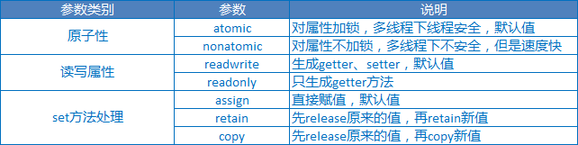
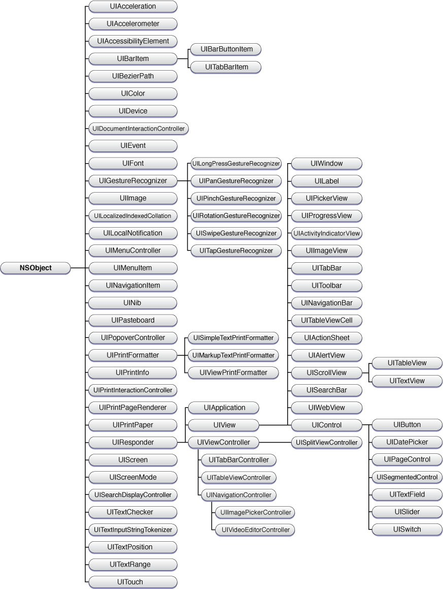

# iOS Skill

## 目标

+ [X] Objective-C
	+ [X] 基本语法
	+ [X] 面向对象
	+ [X] 内存管理
	+ [X] Category、Protocol、Block
	+ [X] Copy、KVC/KVO
	+ [X] Foundation框架
+ [ ] Swift 3.0 语言基础
+ [ ] iOS
	+ [X] iOS控件使用
		+ [X] StoryBoard／Xib文件／纯代码方式
		+ [X] UIButton/UILabel/UITable/UINavigator/UIImageView
	+ [X] 多线程编程
		+ [X] pThread  
		+ [X] NSThread
		+ [X] NSOperation
		+ [X] GCD 
	+ [ ] 网络编程
		+ [X] NSURLConnection
		+ [ ] NSURLSession
		+ [ ] AFNetworking
		+ [ ] CFNetwork 
	+ [X] 文件操作
		+ [X] NSString读写文件
		+ [X] NSFileManager 
	+ [X] 数据库操作
	+ [X] ViewController之间的数据传递
	+ [ ] QuartzCore框架 
	+ [ ] 自定义View
	+ [ ] iOS多媒体
	+ [ ] iOS系统服务
	+ [ ] iOS App之间数据传递
		+ [ ] UIDocumentInteractionController
		+ [ ] UIActivityViewController
		+ [ ] Shared Keychain Access
		+ [ ] Custom URL Scheme
		+ [ ] Web Service
		+ [ ] iCloud API 
		+ [ ] UIPasteboard   

## 笔记
### Objective-C

+ 头文件／实现文件（.h/.m)
+ +／-方法（类方法——静态方法／普通方法——对象方法声明）
+ @"string"：OC字符串——NSString
+ goto：高级跳转语句[*慎用*]

```Objective-C
int i = 0;
print: {
	i++;
	NSLog(@"i 的值为%d",i);
}	
if (i < 5) goto print;
``` 
+ switch条件只能放置`数值类型`或者`字符类型`不能放`字符串`【`Java 7能放置`】
+ 实例化对象

```objective-c
// [ 类名／对象名 方法名]
// alloc —— 为对象分配内存空间
// init —— 进行初始化
People *p1 = [[People alloc] init];
```
+ 类成员变量和属性

```objective-c
// .h 文件进行相关定义
@interface People : NSObject
{
	// 成员变量，给类内使用
	@public // 公有属性需要通过 -> 操作才能调用
	NSString * _peopleName;
	int _peopleAge;
	int _peopleSex; 
}
// 属性名，给类外使用，需要在.m 文件通过@synthesize进行与成员变量的关联
@property(nonatomic,strong)NSString * peopleName; //可以直接通过 . 操作进行调用
// 通过方法进行调用，需要在.m文件提供具体实现。调用方式[p1 setName:@"xxx"]
- (void) setName:(NSString *) name;
- (NSString *) getName; 
- (int) showWith:(int) first andSecond:(int) second;
@end
```

+ 初始化方法

```objective-c
// id 类似于Java范型，可以为任何类型
-(id) init;
// 方法的重写
-(instancetype) init;
``` 
自定义初始化方法

```objective-c
// .h文件
-(instancetype)init;
-(instancetype)initWithPeopleName:(NSString *) peopleName andPeopleAge:(int) peopleAge;

// .m文件
-(instancetype) init{
	self = [super init];
	if (self){
		_peopleName = "Visitor";
		_peopleAge = 30;
	}
	return self;
}
-(instancetype) initWithPeopleName:(NSString *) name andPeopleAge:(int) age {
	self = [super init];
	if (self){
		_peopleName = name;
		_peopleAge = age;
	}
	return self;
}
```

+ OC方法没有访问修饰符，如果父类中的方法没有在.h文件中写声明则子类不能集成该方法
+ OC没有多继承，protocol与Java 接口类似

```objective-c
// 实现协议方式
@protocol Printable <NSObject> // 协议继承别的协议
@optional // 一个类implements该协议时，可以不实现此方法
	- (void) print:(NSString *) str;
@end 

// 协议的实现
@interface class MyClass : NSObject<Printable,Drawable>
@end
```

+ OC的多态
	+ 继承
	+ 方法重写 
	+ Protocol
+ Catrgory(分类)：给一个已经存在的类增加方法，而不用去改变它的源码

```objective-c
// .h 文件 NSObject+Json.h：给NSOject类增加toJson方法
@interface NSObject (Json)
	-（NSString *）toJson;
@end

// .m 文件
@implementation NSObject (Json)
	- (NSString) toJson{
		// ...
	}
@end
```

+ 内存管理：系统不会自动释放堆中的内存
	+  引用计数器：在Objective-C中每个对象内部都有一个与之对应的整数，叫做“引用计数器”。当一个对象在创建之后它的引用计数器为1，当调用这个对象的`alloc、retain、new、copy`方法之后引用计数器自动在原来的基础上`加1`，当调用这个对象的`release`方法之后它的引用计数器`减1`。如果一个对象的引用计数器为`0`，则系统会自动调用这个对象的`dealloc`方法来销毁这个对象
	+  属性参数：`@property`——快速实现getter、setter方法
		+  MRC默认参数：`(atomic,readwrite,assign)`
		+ ARC默认参数：`基本数据默认属性参数：(atomic,readwrite,assign)，对象类型默认属性参数：(atomic,readwrite,strong)`
	
	+  自动释放池：`@autoreleasepool`
		+ autorelease方法不会改变对象的引用计数器，只是将这个对象放到自动释放池中
		+ 自动释放池实质是当自动释放池销毁后调用对象的release方法（不能保证一定将该对象释放）
		+ 由于自动释放池最后统一销毁对象，因此如果一个操作比较占用内存，最好不要放倒自动释放池或者考虑放到多个自动释放池
		+ Objective-C中类库中的静态方法一般都不需要手动释放，内部已经调用了autorelease方法  
	+  内存释放原则：`谁创建，谁释放`
+ 野指针：指向一个被释放对象的指针变量[`需要将该变量设置为nil`]
	+ 表现为：`Thread 1:EXC_BAD_ACCESS(code=EXC_I386_GPFLT)`错误 

+ 内存管理的两种方式
	+ MRC（手动引用计数）：
		+ assign：用于基本数据类型
		+ retain：用于非字符串对象
		+ copy：用于字符串对象、block、NSArray、NSDictionary
	+ ARC（自动引用计数）：
	   + strong：会引起引用计数加1.是指针拷贝（浅拷贝），不会拷贝内容
	   + weak：当所指对象被销毁时，指针会自动被设置为nil，防止野指针
	   + copy：先copy一个相同对象。再创建一个strong指针。（深拷贝，会拷贝内容）
	   + unsafe_unretained：（不安全引用）用于基本数据类型  
+ `#pragma mark -`：以#pragma开头的代码是一条编译器指令。是一个特定于程序或编译器的指令。该指令告诉Xcode编译器，要在编辑窗格顶部的方法和函数弹出菜单中将代码分隔开

+ Block：也是一种类型
	+ 类型定义：`返回值类型(^ 变量名)(参数列表)`
	+ typedef定义：`返回值类型(^ 变量名)(参数列表)`
	+ 实现：`^(参数列表){操作主体}`
	+ Block中可以读取块外面定义的变量但是不能修改，如果要修改这个变量则必须声明`_block`修饰

+ 定义宏：`#define PI 3.1415926 `  [`Java全局变量`]

+ Objective-C动态机制
	+ KVC（`键值编码`）：不进行任何操作就可以进行属性的动态读写（由`NSKeyValueCoding`协议提供，NSObject实现了该协议）
		+ 动态设置：`setValue:属性值 forKey:属性名`——用于简单路径、`setValue:属性值 forKeyPath:属性路径`——用于复合路径（`对象里面的对象`）
		+ 动态读取 ：`valueForKey:属性名`、`valueForKeyPath:属性名`——用于复合路径
	+ KVO（`键值监听`）：一种观察者模式，用于实现视图组件和数据模型的分离（由`NSKeyValueObServing`协议提供，NSObject已经实现了该协议）
		+ 使用方式
			+ 通过`addObserver: forKeyPath: options: context:`注册监听器
			+ 重写监听器的`observerValueForKeyPath: ofObject: change: context:`方法
		+ 常用操作   
			+ 注册指定Key路径的监听器：`addObserver: forKeyPath: options: context:`
			+ 删除指定Key路径的监听器：`removeObserver: forKeyPath`、`removeObserver: forKeyPath: context:`
			+ 回调监听 ：`observeValueForKeyPath: ofObject: change: context:`

+ Copy
	+ copy/retain区别
		+ copy：创建一个新对象
			+ copy：遵守`NSCopying`协议的类才可以发送`copy`消息[`只有NSString到NSString的拷贝是浅拷贝，其他的都是深拷贝`]
			+ mutableCopy：守`NSMutableCopying`协议的类才可以发送`mutableCopy`消息[`深拷贝`] 
		+ retain：创建一个指针，引用对象计数加一[`浅拷贝`]
+ 文件操作：在Objective-C中路径、文件读写等操作是利用字符串来完成的

```objective-c
// 读取文件
NSString *path = @"/Users/Stokey/Desktop/test.txt";
NSString *outInfo =  [NSString stringWithContentsOfFile:path encoding:NSUTF8StringEncoding error:nil];  

// 写入文件
NSError * error;
NSString *inputInfo =@"hello objective-c";
[inputInfo writeToFile:path atomically:YES encoding:NSUTF8StringEncoding error:&error];
if (error) {
	NSLog(@"write file fail, the error is %@", [error localizedDescription]);
} else {
	NSLog(@"write file success !");
}
```	

+ NSArray
	+ NSArray中只能存放对象，不能存放基本数据类型，通常通过在基本数据类型前加@进行转换
	+ 数组中的元素后面必须加nil以表示数据结束
	+ `makeObjectsPerformSelector`执行数组中对象的方法，其参数最多只能有一个
+ 多线程
	+ pThread：基于C语言框架，不常用
		+ pthread_create 
	+ NSThread
		+ 创建线程
			+ [[NSThread alloc] initWithTarget: selector: object:]
			+ [NSThread detachNewThreadSelector: toTarget: withObject:]
			+ [self performSelectorInBackground: withObject:]
		+ 线程同步
			+ @synchronized(self){}
			+ [NSCondition lock] / [NSCondition unlock]
	+ GCD
		+ 创建线程
			+ `dispath_async(dispatch_queue_t , ^{})`
			+ `dispath_async(dispatch_get_main_queue(), ^{})//主线程`
			+ `dispatch_async(dispatch_get_global_queue(),^{})//创建子线程`
		+ 创建线程任务队列
			+ 创建并发线程队列

			```objective-c
			dispatch_queue_t queue = dispatch_queue_create("key.queue", DISPATCH_QUEUE_CONCURRENT );
			dispatch_async(queue, ^{}) ;//或创建多个线程，线程并发执行 
			```
			
			+ 创建线程任务队列
		
			```objective-c
			dispatch_queue_t queue = dispatch_queue_create("key.queue", DISPATCH_QUEUE_SERIAL);
			dispatch_async(queue, ^{}) ;//只创建一个线程，但是改线程当中有多个任务 
		```
		
		+ dispatch_group
			+  dispatch_group_async
			+  dispatch_group_enter/dispatch_group_leave
		+ 单例模式：`dispath_once(dispatch_once_t,^{})`
		+ 延迟执行：`dispatch_after(dispatch_time(DISPATCH_TIME_NOW),(int64_t)(2*NSEC_PER_SEC)), dispatch_get_main_queue(), ^{})`  
		   
	+ NSOperation  
		+ NSOperationQueue：线程池，用于管理NSOperation
			+ addOperation
			+ setMaxConcurrentOperationCount
		+ 状态
			+  ready
			+  cancelled
			+  executing
			+  finisshed
			+  asynchronous
		+ 依赖：`addDependency`
		+ 具体实现
			+ NSInvocationOperation/NSBlockOperation：同步方法
			+ NSOperationQueue：异步方法   
 
 + frame/bounds区别
 	+ frame：`相对于父视图中的坐标位置和大小`
 	+ bounds：`相对于View本身的坐标系统`
 	+ center：`相对于父视图中的位置和大小` 

 + 	ViewController之间的数据传递
 	+ A -> B (`父视图——>子视图`)
 		+  在Storyboard上面连接视图控制器A和控制器B，点击连线。在属性设置窗口设置`segueidentifier`——`MainToCheck`
 		+  在 B ViewController的.h文件中定义属性 _showArray用于接收属性
 		
	 		```objective-c
	 		@property (string,nonatomic) NSArray *showArray;
	 		```
		+  在 A ViewController.m文件中设置`-(void) prepareForSegue:(UIStoryboardSegue *) segue sender:(id) sender方法`
		
			```objective-c
			-(void)prepareForSegue:(UIStoryboardSegue *)segue sender:(id)sender{  
				if ([[segue identifier] isEqualToString:@"MainToCheck"]) {  
					CheckViewController *CheckVC = [segue destinationViewController];  
					CheckVC.showArray = [[NSArray alloc] initWithArray:_currentArray];  
				}  
			}  
			```
 	+ B -> A  (`子视图——>父视图`)：让A成为B的代理，在B中调用A的代理方法，通过代理方法的参数传递数据给A
 		+ 在B .h文件中添加协议(`#import和#interface之间`)，并添加delegate属性
 		
	 		```objective-c
	 		@class LoadViewController;
	 		@protocol CheckViewDelegate <NSObject>
	 		-(void) LoadDataViewController:(CheckViewController *) controller didFinishLoadData:(NSMutableArray *) loadedArray; 
	 		@property (nonatomic, weak) id <LoadViewDelegate> delegate;
	 		@end
 			``` 
 		+ 在B ViewController.m中调用代理方法，将数据通过代理方法传递给其代理
 		
	 		```objective-c
	 		[self.delegate LoadDataViewController: self didFinishLoadData: testArray];
	 		```
	 		
 		+ 在A ViewController.m文件中实现B的代理方法
 		
 			```objective-c
 			-(void)LoadDataViewController:(CheckViewController *)controller didFinishLoadData:(NSMutableArray *)loadedArray{  
 				self.currentArray = loadedArray;  
 			}  
 			```
 		
### Swift

### iOS
系统结构：


+ Cocoa Touch：`基于iPhone OS应用层直接调用层，如触摸事件、相机管理等`
	+ UIKit

	+ MapKit
	+ Multi-Touch Events
	+ Core Motion
	+ Camera
	+ View Hierarchy
	+ Localization
	+ Alerts
	+ Web Views
	+ Image Picker
	+ Multi-Touch Controls 
+ Media：该层框架和服务依赖Core Services层，向Cocoa Touch层提供画图和多媒体服务，如声音、图片、视频等
	+ Core Audio
	+ OpenGL
	+ Audio Mixing
	+ Audio Recording
	+ Video Playback
	+ JPG/PNG/TIFF/PDF
	+ Quartz
	+ Core Animation
	+ OpenGL ES

+ Core Services：提供核心服务，如字符串处理函数、集合管理、网络管理、URL处理工具、联系人维护、偏好设置等
	+ Core Foundation
	+ Foundation
	+ CloudKit
	+ HealthKit
	+ HomeKit
	+ Collections
	+ Address Book
	+ Networking
	+ File Access
	+ SQLite
	+ Core Location
	+ Net Services
	+ Threading
	+ Perferences
	+ URL Utilities

	
+ Core OS：最底层核心操作系统层
	+ 框架
		+ Accelerate 加速框架
		+ Core Bluetooth Framework（核心蓝牙框架）
		+ External Accessory Framework（外部附件框架）
		+ Generic Security Services Framework（通用安全服务框架）
		+ Security Framework（安全框架）
		+ System
		+ 64-Bit Support
	+ 组件
		+ OS X Kernel
		+ Mach 3.0
		+ BSD
		+ Sockets
		+ Power Mgmt
		+ File System
		+ Keychain
		+ Certificates
		+ Security
		+ Bonjour 
