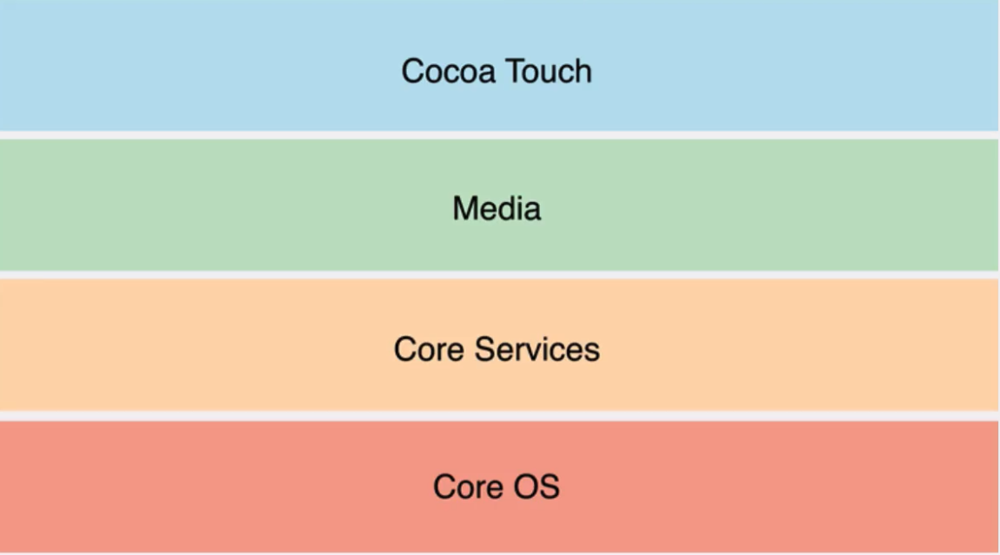

# iOS Skill

## 目标

+ [ ] Objective-C
	+ [X] 基本语法
	+ [X] 面向对象
	+ [ ] 内存管理
	+ [ ] Category、Peotocol、Block
	+ [ ] Copy、KVC/KVO
	+ [ ] Foundation框架
+ [ ] Swift 3.0 语言基础
+ [ ] iOS
	+ [ ] iOS控件使用
		+ [ ] StoryBoard
		+ [ ] Xib文件
		+ [ ] 纯代码方式
	+ [ ] 多线程编程
		+ [ ] NSThread
		+ [ ] NSOperationQueue
		+ [ ] GCD 
	+ [ ] 网络编程
		+ [ ] NSURLConnection
		+ [ ] AFNetworking
		+ [ ] CFNetwork 
	+ [ ] QuartzCore框架 
	+ [ ] 自定义View
	+ [ ] 数据库操作
	+ [ ] iOS多媒体
	+ [ ] iOS系统服务  

## 笔记
### Objective-C

+ 头文件／实现文件（.h/.m)
+ +／-方法（类方法——静态方法／普通方法——对象方法申明）
+ @"string"：OC字符串——NSString
+ goto：高级跳转语句[*慎用*]

```Objective-C
int i = 0;
print: {
	i++;
	NSLog(@"i 的值为%d",i);
}	
if (i < 5) goto print;
``` 
+ switch条件只能放置`数值类型`或者`字符类型`不能放字符串【`Java 7能放置`】
+ 实例化对象

```objective-c
// [ 类名／对象名 方法名]
// alloc —— 为对象分配内存空间
// init —— 进行初始化
People *p1 = [[People alloc] init];
```
+ 类成员变量和属性

```objective-c
// .h 文件进行相关定义
@interface People : NSObject
{
	// 成员变量，给类内使用
	@public // 公有属性需要通过 -> 操作才能调用
	NSString * _peopleName;
	int _peopleAge;
	int _peopleSex; 
}
// 属性名，给类外使用，需要在.m 文件通过@synthesize进行与成员变量的关联
@property(nonatomic,strong)NSString * peopleName; //可以直接通过 . 操作进行调用
// 通过方法进行调用，需要在.m文件提供具体实现。调用方式[p1 setName:@"xxx"]
- (void) setName:(NSString *) name;
- (NSString *) getName; 
- (int) showWith:(int) first andSecond:(int) second;
@end
```

+ 初始化方法

```objective-c
// id 类似于Java范型，可以为任何类型
-(id) init;
// 方法的重写
-(instancetype) init;
``` 
自定义初始化方法

```objective-c
// .h文件
-(instancetype)init;
-(instancetype)initWithPeopleName:(NSString *) peopleName andPeopleAge:(int) peopleAge;

// .m文件
-(instancetype) init{
	self = [super init];
	if (self){
		_peopleName = "Visitor";
		_peopleAge = 30;
	}
	return self;
}
-(instancetype) initWithPeopleName:(NSString *) name andPeopleAge:(int) age {
	self = [super init];
	if (self){
		_peopleName = name;
		_peopleAge = age;
	}
	return self;
}
```

+ OC方法没有访问修饰符，如果父类中的方法没有在.h文件中写声明则子类不能集成该方法
+ OC没有多继承，protocol与Java 接口类似
+ OC的多态
	+ 继承
	+ 方法重写 
### Swift

### iOS
系统结构：



+ Cocoa Touch：`基于iPhone OS应用层直接调用层，如触摸事件、相机管理等`
	+ UIKit
	+ MapKit
	+ Multi-Touch Events
	+ Core Motion
	+ Camera
	+ View Hierarchy
	+ Localization
	+ Alerts
	+ Web Views
	+ Image Picker
	+ Multi-Touch Controls 
+ Media：该层框架和服务依赖Core Services层，向Cocoa Touch层提供画图和多媒体服务，如声音、图片、视频等
	+ Core Audio
	+ OpenGL
	+ Audio Mixing
	+ Audio Recording
	+ Video Playback
	+ JPG/PNG/TIFF/PDF
	+ Quartz
	+ Core Animation
	+ OpenGL ES

+ Core Services：提供核心服务，如字符串处理函数、集合管理、网络管理、URL处理工具、联系人维护、偏好设置等
	+ Core Foundation
	+ Foundation
	+ CloudKit
	+ HealthKit
	+ HomeKit
	+ Collections
	+ Address Book
	+ Networking
	+ File Access
	+ SQLite
	+ Core Location
	+ Net Services
	+ Threading
	+ Perferences
	+ URL Utilities

	
+ Core OS：最底层核心操作系统层
	+ 框架
		+ Accelerate 加速框架
		+ Core Bluetooth Framework（核心蓝牙框架）
		+ External Accessory Framework（外部附件框架）
		+ Generic Security Services Framework（通用安全服务框架）
		+ Security Framework（安全框架）
		+ System
		+ 64-Bit Support
	+ 组件
		+ OS X Kernel
		+ Mach 3.0
		+ BSD
		+ Sockets
		+ Power Mgmt
		+ File System
		+ Keychain
		+ Certificates
		+ Security
		+ Bonjour 
